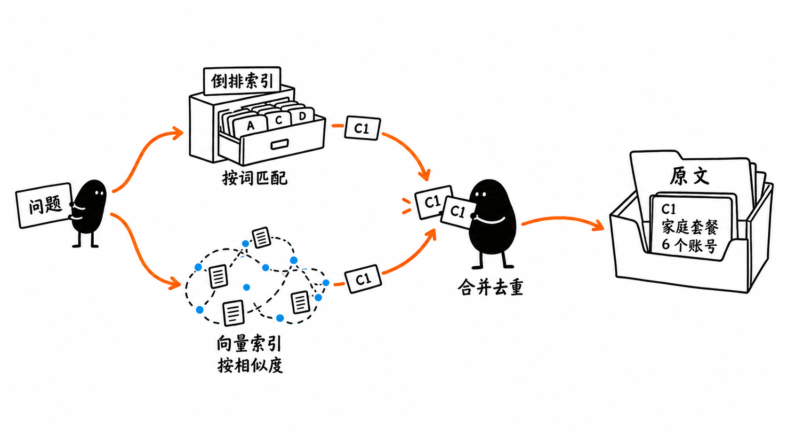

# 第 12 课配图：两条检索路线与原文取回

状态：使用内置 image_gen 生成，清理版完成目视检查；作者已确认图片与图注，现已嵌入第 12 课正文。未使用 API/CLI 备用方案。



插入第 3 节 Hybrid Search 解释结束后、第 4 节 Context Assembly 之前。

图注：关键词检索与向量检索分别找候选，不是前后串联。混合检索融合两路结果，再选取原文交给模型。图中两路都命中 C1 只为展示去重，不要求每份资料都被两路同时找到；排序和适用性检查仍需完成。

图形边界：索引与原文分开画是为了说明关联，不强制要求两套数据库或第二次数据库查询；接口可以直接返回原文。向量点阵只比喻相似关系，不代表真实向量维度、分值或检索实验。两处小黑表示查询发起与候选整理两个阶段，不表示启动了两个 Agent。单独使用任一路线也能检索，图展示的是混合使用的例子。

目视检查：两路之间无串联箭头，候选只在合并处汇合，C1 对应原文；中文正确，留白充足。首版误生成透明背景，清理版改为白底。

原始文件均保留：

- 首版：`/Users/liuwei/.codex/generated_images/01a03705-7158-7c93-9e82-03b467e7dc98/exec-120fe824-7be5-4680-9995-81285af5d79e.png`
- 白底版：`/Users/liuwei/.codex/generated_images/01a03705-7158-7c93-9e82-03b467e7dc98/exec-bc29f822-cd3d-4f91-8c41-9b0fb738009e.png`

## 首次提示词

```text
Generate one standalone 16:9 horizontal Chinese book-body illustration in Ian Xiaohei minimalist absurd hand-drawn style. Pure white background, thin slightly uneven black ink, sparse orange arrows and blue accents, at least 40% empty white margins. No gradients, shadows, paper textures, PPT panels, software UI, formal flowchart boxes, title or explanatory paragraphs. Serious solid-black bean-shaped Xiaohei, white dot eyes and thin limbs, actively does the central work, not decorative.

Explain one precise relation: keyword retrieval and dense-vector retrieval are two PARALLEL ways to find candidate text chunks. A hybrid search can combine the candidate IDs and then obtain the original text. A vector query DOES NOT go through the inverted index. Neither index should be drawn feeding the other.

Invent a small absurd archive-search scene, no pneumatic tubes, conveyor belts or stamp toolbox. At the left is one small question card labeled "问题". Its two orange paths diverge clearly: an upper path reaches a little open alphabetical card catalogue labeled "倒排索引" with the short annotation "按词匹配"; a lower independent path reaches a tiny hand-drawn spatial constellation of dots/cards labeled "向量索引" with the short annotation "按相似度". The constellation is only a similarity metaphor, no invented numerical scores or model dimensions.

Both lookup devices independently yield small candidate-ID slips. Show a "C1" slip from each route; they travel toward the same Xiaohei in the center-right. Xiaohei is actively bringing these two overlapping C1 slips together and keeping one, labeled "合并去重". No connection at all from the vector device to the inverted device.

At the far right, a single open folder labeled "原文" contains one clearly visible original-text card with ID "C1" and text on two lines: "家庭套餐" / "6 个账号". Xiaohei's remaining hand or a simple short orange motion arrow connects the retained ID to that original card: it is ID-to-original retrieval, not a newly generated answer. Do not draw a language model or a chat response here; that next stage belongs in the book text.

Only these annotation blocks are allowed: "问题", "倒排索引", "按词匹配", "向量索引", "按相似度", "合并去重", "原文", and the original card's data block "C1 / 家庭套餐 / 6 个账号". Candidate slips may each show only "C1". No English terminology, legend, footnote, warning sentences, extra objects or decorative pens/books. Upper/lower routes must be visually independent and converge only at Xiaohei's deduplication action. Make the two indexes and the original content storage clearly distinct physical things. The duplicate C1 cards are an illustrative example, not a requirement that both routes must always find the same thing. White spacious sketch, deadpan mildly absurd, not cute or corporate.
```

## 背景修正提示词

```text
Edit this image only to correct the background and readability. The current PNG has a transparent background. Replace every transparent background area with fully opaque pure white (#FFFFFF). Make the paper cards, index box and original-text folder white inside with clear black hand-drawn outlines and black lettering. Preserve both solid-black Xiaohei figures, the existing composition, the two independent orange retrieval paths, blue similarity dots, the candidate C1 slips, all exact Chinese labels and the original card "C1 / 家庭套餐 / 6 个账号". The upper inverted-index route and the lower vector-index route must remain independent, merging only at the deduplication step. No arrows between the two indexes. Keep the right-hand original-text retrieval step.

Deliver a fully opaque, easy-to-read white-background image, NOT transparent, NOT dark, with the same 16:9 size. Do not add any extra labels, legend, title, symbols or props. Retain generous white margins and the minimalist hand-drawn appearance. This is a background correction, not a redesign.
```
