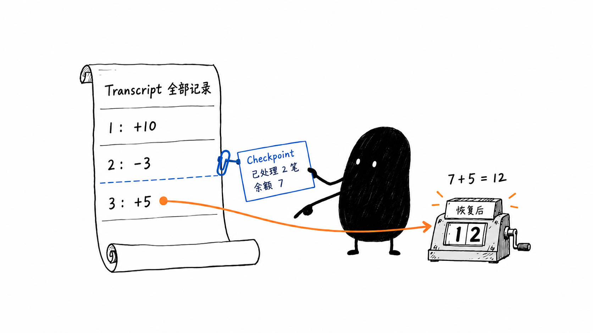

# 第 4 课配图试点：完整记录与恢复点

状态：预览已生成并通过内容目视检查，作者反馈“图有帮助的”，已按预览位置嵌入第 4 课正文。该反馈表明阅读体验得到帮助，不等于已经完成独立复述验证。使用内置 image_gen，未使用 API/CLI 备用方案。



已插入第 4 课第 2 节“这里是把已记录的第三笔算进余额……不代表把历史工具调用重新执行一遍。”之后、“放回排查助手”之前。原有代码和表格保持不变。

图注：快照已计入前两笔，恢复从余额 7 接着处理第三笔加 5。完整流水仍保留；这里重建的是状态，不是重做历史动作。

验收问题：不看正文时，能否解释为什么恢复只处理第三笔，而完整流水仍有三笔？本图不解释 JSON/JSONL 存储布局，不保证所有快照都能恢复完整进程。

目视检查：快照关联第 2、3 笔之间，数字与正文一致，完整流水未删除；小黑持快照并指向后续记录。首版多出长说明和桌面杂物，清理版已移除，只保留核心对象和短标注。

原始文件均保留：

- 首版：`/Users/liuwei/.codex/generated_images/01a03705-7158-7c93-9e82-03b467e7dc98/exec-ec086c49-1413-4ef2-91c2-b1de37923736.png`
- 清理版：`/Users/liuwei/.codex/generated_images/01a03705-7158-7c93-9e82-03b467e7dc98/exec-15824bac-f517-4197-bf51-93b58521d235.png`

## 首次提示词

```text
Create one standalone 16:9 horizontal Chinese book-body illustration in a minimalist Ian Xiaohei absurd hand-drawn style. Pure white background, slightly uneven thin black ink lines, lots of empty space (at least 40%), sparse blue and orange annotations. No title at top left, no PPT layout, no flowchart boxes, no commercial vector look, no gradients, shadows, texture or cute mascot.

Explain ONE precise concept: a transcript is the complete sequence of recorded events, while a checkpoint holds state at a specific point. Restoring from the checkpoint processes only the subsequent recorded event. This is calculating state from records, NOT depositing money again and NOT rerunning external actions.

Scene: an odd little bookkeeping workbench. On the left a long intact paper ledger stands unrolled and clearly shows exactly these three rows, in order:
"1：+10"
"2：-3"
"3：+5"
The ledger has the short handwritten label "Transcript 全部记录".
At the boundary AFTER row 2 and BEFORE row 3, a blue paper clip attaches a small snapshot card beside the ledger. The card must read exactly:
"Checkpoint"
"已处理 2 笔"
"余额 7"
This card visibly corresponds to the state after the first two rows, not to the entire ledger. Do not cross out, tear off, delete or discard the first two ledger rows: the full history remains.

On the right, Xiaohei (solid black uneven bean-shaped creature, two small white dot eyes, very thin legs and arms, serious blank expression, not cute) is actively restoring a tiny old mechanical number counter on the workbench. One hand uses the checkpoint card as the starting state; the other hand points specifically to the third recorded ledger row. A single restrained orange route from row 3 guides the eye toward the workbench. The counter displays a large legible "12", with the short label "恢复后". A small handwritten calculation near the counter may read "7 + 5 = 12". Do not depict coins, cash transfer, bank deposits, or any real-world transaction. Xiaohei is calculating from existing records; if removed, the core action should be lost.

Composition: ledger and clipped checkpoint on left half, working Xiaohei and counter on right half, generous quiet white upper and lower margins. The grouping should look like one lightly sketched absurd workbench scene, not a classroom infographic. Use no more than 8 annotation blocks. Keep the two English terms spelled exactly Transcript and Checkpoint; all Chinese must be correct. Blue only for checkpoint association and orange only for the selected subsequent event. Make the checkpoint boundary and the preserved full ledger unambiguous. Do not reuse conveyor belt, gate-stamping toolbox, pneumatic-tube or three-robot compositions.
```

## 清理提示词

```text
Edit this illustration to remove clutter, while preserving the core diagram and its correct arithmetic. Keep the 16:9 composition and all four core objects in their same positions: the left rolled ledger, the blue clipped Checkpoint card, the central black Xiaohei holding it and pointing, and the right mechanical counter. Preserve exactly the labels on those four objects: "Transcript 全部记录"; rows "1：+10", "2：-3", "3：+5"; "Checkpoint", "已处理 2 笔", "余额 7"; "恢复后", display "12", and small calculation "7 + 5 = 12". Preserve the blue checkpoint boundary after row 2, and the orange arrow from row 3 to the counter. Preserve Xiaohei's black body, white dot eyes, serious expression and active hands.

REMOVE completely: all books at bottom left, both pencil/tool cups at left and right, all pens and tools, the paper of long explanatory notes at bottom right, the screwdriver and screws, the entire horizontal tabletop/background line, and all background/table hatching, cast shadows or textures. Fill removed areas with perfectly clean pure white. There must be NO text anywhere except the short labels explicitly listed above. Do not add a heading, footnote, title, warning, legend, explanation or border.

Keep the result sparse, airy, thin slightly imperfect black hand-drawn outlines, sparse blue and orange only, at least 40% blank white margins. No PPT design and no extra props. Retain the clipped card's physical connection to the boundary after the first two records. Do not change the quantities or the semantic relationship. This is a focused cleanup edit, not a new composition.
```
