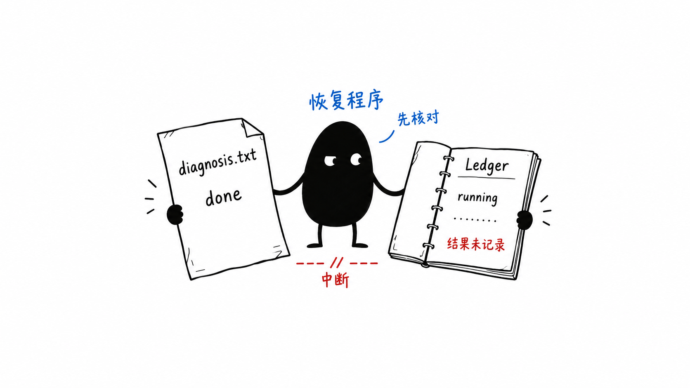

# 第 6 课配图：动作已发生，回执未记录

状态：内置 image_gen 已生成预览，文字与角色目视检查通过；作者已确认图片与图注，现已嵌入第 6 课正文。



插入位置：第 1 节解释“确认旧执行者已经中断后，遗留的 running 应转为 unknown”及其两种可能之后。

图注：图中是写入已完成、回执未记录的情况；账本里的 running 是旧进程最后留下的记录。中断也可能发生在写入前，恢复时要核对证据，不能只凭缺少回执就重做。

技术边界：左侧文件代表已产生的效果，右侧显示落后的旧记录，小黑标为恢复程序而非模型。图不把未知结果标成 failed，也不暗示文件内容相同就能证明旧动作是谁执行的。它是正文假设场景的解释图，不是新的执行证据。

原始文件：`/Users/liuwei/.codex/generated_images/01a03705-7158-7c93-9e82-03b467e7dc98/exec-42de8af9-2af2-4b5a-ba35-c03d5006a0cf.png`。原图保留，未覆盖现有资产。

## 生成提示词

```text
Generate one standalone 16:9 Chinese technical-book body illustration in Ian Xiaohei style. Pure clean white background, thin slightly wobbly black hand-drawn ink, sparse blue and a tiny red accent, at least 45% blank white space. No gradients, shadows, paper texture, desktop background, decorative props, PPT boxes, flowchart nodes, UI screenshots, title or explanatory paragraphs.

One focused conceptual scene: the actual file was successfully written but the process stopped before recording the completion receipt. A recovery program must inspect evidence rather than blindly repeat the write. This scene is ONE example of missing results, NOT a claim that every unknown operation succeeded.

Central Xiaohei is a solid black irregular bean-shaped creature, white dot eyes, thin legs and two long thin arms, serious blank expression, not cute. Xiaohei actively holds and compares two distinct physical objects, one on each side. Xiaohei is the RECOVERY PROGRAM here, not the language model.

On the left, a single oversized loose report sheet with a folded corner, showing exactly the filename "diagnosis.txt" and the content "done". It clearly represents the already-existing output file. It has no new writing pen and no duplication or second copy.

On the right, a small open paper execution ledger, visibly a bound notebook rather than a UI panel, labeled "Ledger". Its last filled record is exactly "running". Under that there is a blank dotted line where the completion result is missing, and a short red handwritten note "结果未记录". There must NOT be any "failed" or "succeeded" label.

Xiaohei grips the finished report with one hand and supports the open ledger with the other, looking between them. Place a small blue handwritten label "恢复程序" above Xiaohei and a smaller blue "先核对" nearby. A small red interruption mark or split dash between the two objects can carry the label "中断", but no dramatic explosion or electrical outage. It indicates the gap between producing a file and recording its result, not physical damage to the file.

Use exactly these short labels, no additional text: "diagnosis.txt", "done", "Ledger", "running", "结果未记录", "恢复程序", "先核对", "中断". The report and ledger should be large enough to read but the entire scene should occupy only the central half to two thirds of the canvas with ample empty margins. No coins, warning signs with long sentences, stamps, conveyor belts, pneumatic tubes, flowchart arrows, extra books or tools. This should feel like an absurd but accurate little incident inspection, not a classroom slide. Keep the file intact and the ledger's running record intact; the missing result must remain visibly absent.
```
