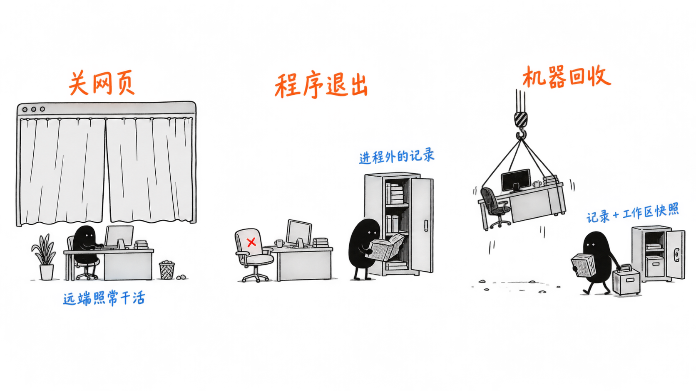

# 第 11 课：持久状态与云端执行——关掉网页后，任务还能接上吗

假设你交给助手一个任务：把 `config.json` 的主题改成 `dark`，端口保持 `3000`。文件已经写好，检查还没结束，你关掉了网页。再次打开时，能看到结果吗？

答案取决于关掉的是哪一部分。只关了网页，远端程序可能还在干活；程序自己退出了，就得有别的程序接手；如果连机器和磁盘都一起没了，刚改好的文件还得能从别处找回来。

这三种情况，一种比一种丢得多。本课按这个顺序走一遍，每一步只问一个问题：**这一次丢了什么，要靠什么接上？** 最后再用这三个问题去看产品宣传里的“后台运行”“可恢复”。

## 1. 关掉网页：先看任务在哪里执行

先只关网页。如果任务已经交给远端一个能独立运行的程序，浏览器只负责显示进度，那么关掉浏览器，远端仍然在修改文件、运行检查。再打开同一个任务时，应用把保存的进度和结果取回来给你看。

如果运行程序就在你本机的终端里，关掉终端或让电脑休眠，任务就可能跟着停下。所以第一个要问的是：**真正干活的程序在哪台机器上？** 界面关了，它还在不在。

托管的云端 Agent 属于前一种。例如 Codex Cloud 在托管容器里检出仓库、修改并检查，最后交回回答和文件差异；你的电脑只是交互入口。[1]

不过，关网页后还能看到结果，只说明这个任务不依赖网页。干活的程序也会崩溃，它所在的机器也可能被回收，这两种情况要另外处理。

## 2. 程序退出：接手的程序要读到进程外的记录

换一种故障：执行程序在检查结束前退出了。新启动的程序打开 `config.json`，看见主题已经是 `dark`，却不知道端口应该是多少，也不知道旧程序有没有做过检查。

它要接得上，至少得读到三样东西：原来的要求、已经发出的工具申请、已经保存的结果。这些就是[第 4 课](04-会话持久化.md)讲的会话记录。放到这里，关键多了一条：**记录必须存在旧进程之外。** 只留在旧进程内存里的东西，进程一退出就没了。

于是可以把一个 Agent 拆成三块，分开安排：

| 部分 | 在本任务中负责什么 | 退出或更换时 |
| --- | --- | --- |
| 运行程序（[第 2 课](02-Agent运行时.md)的 Harness） | 调用模型、安排工具、处理结果 | 可以换一个新进程接手 |
| 会话记录 | 保存要求、调用申请和结果 | 必须存在进程之外 |
| 执行环境 | 真正读写 `config.json`、运行检查的地方 | 沙盒限制要跟着继续生效 |

Anthropic 的 Managed Agents 就按这个思路拆分：会话日志放在运行程序之外，执行环境通过工具接口访问。运行程序出故障后，新实例读回日志继续处理。[8] 文章把这种安排叫“无状态 Harness”。它运行时照样用内存，只是恢复任务靠的是进程外的记录。

拆开以后，三块也可以放在不同地方。OpenAI Agents API 允许由 OpenAI 运行 Harness，文件和命令操作交给托管环境或你自己的机器。[9] 决定下一步做什么的程序，和实际保存 `config.json` 的机器，可以不在一处。

## 3. 机器被回收：记录和文件要分别保住

再往下丢一层：机器和本地磁盘一起被清理了。假设会话记录存在另一项服务里，写着“配置已经修改”。新机器能读到这句话，却没有修改后的 `config.json`，还是接不上。

记录说的是“发生过什么”，文件是“现在是什么样”，两样要分别保住。即使在旧机器上做过 `git commit`，提交也还在那块磁盘里。要扛过磁盘丢失，得有已推送的提交，或存在机器外的文件副本。某个时刻整个工作区文件的副本，通常叫**工作区快照**。

几类材料要分别找回：

| 材料 | 在这个任务中的作用 |
| --- | --- |
| 会话历史与执行记录 | 找回修改要求，知道哪些动作已有结果、哪些还不确定 |
| 工作区文件与产物 | 找回实际的配置和检查报告，继续核对或交付 |
| 跨任务记忆 | 提供经过确认的项目约定，帮助理解要求 |
| 进程与连接信息 | 判断原检查是否仍在运行，能否重新连接，或需要重建 |

有的接口直接把这几样分开处理。OpenAI Sandbox Agents 分别保存“运行到哪一步”、“怎样连接沙箱”和“用哪些文件准备工作区”。[13] 所以恢复了会话，文件和原来的检查进程未必也一起回来了。

存储还有保留规则。有的平台要为指定目录另外配置存储，才能在计算实例停止后保留文件；有的预览版存储空闲一段时间就会过期。[11][12] 判断一个方案能不能恢复，要找到实际的保存位置和保留期限。



## 4. 文件改好了，结果却没记下来

就算文件和记录都在，也不能把旧的工具调用全部重做一遍。旧程序可能已经写完了文件，只是没来得及记下结果。

配套实验就停在这个位置。程序预设一条写入申请，把配置改成 `dark`、`3000`；文件写好后，立即用 `os._exit(23)` 退出，让成功结果来不及记入执行账本。父进程确认旧进程已经结束，再启动新的恢复进程。

实验准备了两份现场：一份文件保持原样；另一份在恢复前模拟有人把端口改成 `8081`。每份现场都先后启动两次恢复进程，第二次用来检查恢复能否安全重复。实际输出是：

```text
文件符合原请求：进程退出码 23；running -> unknown -> succeeded；恢复未改写文件
再次启动恢复进程：succeeded；文件和账本均未变化，未重复补回执。
文件被人修改：进程退出码 23；running -> unknown -> unknown；恢复未改写文件
再次启动恢复进程：unknown；文件和账本均未变化，未重复补回执。
PASS：两个场景各启动两次独立恢复进程；未调用模型、未验证断电或容器丢失。
```

`running` 是旧进程中断前留下的“正在执行”。新进程先把它改记为 `unknown`，承认结果还没确认，再拿原请求和文件对照。这套记录就是[第 6 课](06-工具可靠性.md)的执行账本（Ledger）。

文件符合原请求时，程序补记“目标已满足”；端口变成 `8081` 时，继续保持 `unknown`，不动现有文件。文件不合格，不能证明原来那次写入失败，可能是先写对了，后来被人改了。反过来，文件合格也不能证明是谁写的、写过几次。最后的 `PASS` 只说明检查符合预期，仍为 `unknown` 的任务不能算成功。

## 5. 看产品：三个问题问清楚

有了前面三层，再看产品里的“后台运行”“持久化”“可恢复”，就能落到具体问题上：

1. **谁在继续执行？** 关掉界面后，运行程序在哪台机器上，由谁负责启停。
2. **记录和文件存在哪、保留多久？** 会话记录、工作区文件是否都在机器外，有没有过期规则。
3. **出故障时谁来处理？** 程序退出或机器回收后，由厂商自动接手，还是需要你重建环境。

按运行程序和执行环境由谁负责，现有方案大致分三类：

| 类型 | 运行程序（Harness） | 执行环境 | 例子 |
| --- | --- | --- | --- |
| 成品 Agent | 厂商负责 | 厂商托管，部分支持接入自己的机器 | Codex Cloud、Cursor Cloud Agents、GitHub Copilot cloud agent[1][2][3] |
| 托管运行平台 | 厂商负责 | 托管环境或自己的机器 | OpenAI Agents API、Claude Managed Agents[9][10] |
| 运行自己的代码 | 你自己负责 | 平台提供计算与存储 | AWS Bedrock AgentCore Runtime[11][12] |

同一类里，各家的细节差别很大。比如 Cursor 接入自己的机器时，工具在你的机器上执行，Agent Loop 仍在 Cursor 云端；GitHub Copilot cloud agent 的开发环境是临时的，代码成果要和机器寿命分开看。[2][3] 这些对照是公开文档里的责任范围，能帮你筛选方案；要知道谁在同一种故障下恢复得更好，还得实际测。更多产品的对照见“往下读”。

## 6. 选执行位置：跟着数据和验收条件走

回到配置任务。如果仓库能取到、依赖能自动装、检查也不依赖本机设备，我会优先考虑托管环境，让工作在你离开电脑后继续。如果配置必须在企业内网或某台专用设备上验证，执行就放在那台机器所在的环境里。

现有产品也保留了这种选择。Cursor 可以连接个人机器或企业统一管理的一组机器；GitHub Copilot cloud agent 支持自托管的 Actions Runner。[2][3]

机器由自己提供时，也要安排文件保存。以 Cursor 的企业机器池为例，一次任务释放机器后，如果没有配置休眠恢复，后续消息可能分配到新机器，旧工作区不会自动带过去。[14]

文件放在哪里，也不能说明全部数据的去向。Cursor 明确说明，工具输出仍可能包含代码，并被送回云端参与推理。[15] 所以执行在哪里、文件存在哪里、哪些内容会传出去，要分别核对。

最后还是打开实际产物验收：主题是不是 `dark`，端口是不是 `3000`，检查结果是不是对应这份最终文件？OpenAI 的文档也说明，一轮完成不保证每个工具都成功。[16] 选定执行位置后，任务是否完成，仍然要看这些具体结果。

## 往下读：更多产品

- **Google Jules**：每项任务使用短期云虚拟机。[4]
- **Amp**：托管 Orb、本地 CLI 或自有 Runner；Orb 可以休眠后继续。[5][6]
- **Grok Bot**：长期角色使用持久的云电脑，同一账号的 Bots 共享电脑、文件和登录状态。[7]
- 各产品的完整对照与边界见[主流方案对比](../research/agent-runtime-market-comparison.md)。

## 配套实践

进入[第 6 课实践](../practice/lesson-06/README.md)的“选做：跨进程恢复”，运行第 4 节的两个场景，再解释为什么一个可以补记成功、另一个应保持 `unknown`。

## 依据与版本

以下产品与平台资料于 **2026 年 9 月 15 日**核验。预览状态、执行限制与存储规则按该日期理解；没有用这些资料给厂商作可靠性排名。核验当时，Claude Managed Agents 与 OpenAI Sandbox Agents 处于 Beta，AWS AgentCore 的 microVM Session Storage 处于预览，空闲 14 天过期、运行时版本更新会清空；Jules 未确认自托管执行或崩溃后检查点恢复的具体承诺。

第 4 节实验的前提是：旧执行者已退出，恢复进程依次运行，文件仍在同一块可访问的磁盘上。实验没有调用模型，也没有验证断电、容器丢失或并发接管。换成发邮件等操作，要查询对应服务的结果，不能靠文件比较判断是否已经执行。

1. [OpenAI Codex：云端执行环境](https://learn.chatgpt.com/docs/environments/cloud-environment)
2. [Cursor：选择 Cloud Agents 的执行位置](https://cursor.com/docs/cloud-agent/self-hosted/choose-runtime)
3. [GitHub Copilot cloud agent：配置执行环境](https://docs.github.com/en/copilot/how-tos/copilot-on-github/customize-copilot/customize-cloud-agent/customize-the-agent-environment)
4. [Google Jules：执行环境](https://jules.google/docs/environment/)
5. [Amp：Orbs 执行环境](https://ampcode.com/docs/orbs)
6. [Amp：Runners](https://ampcode.com/docs/cli/runners)
7. [Grok Bot：电脑与应用](https://docs.x.ai/grok-bot/computer-and-apps)
8. [Anthropic：拆分运行控制与执行环境](https://www.anthropic.com/engineering/managed-agents)
9. [OpenAI Agents API：架构](https://developers.openai.com/api/docs/guides/agents-api/architecture)
10. [Claude Managed Agents：概览与 Beta 状态](https://platform.claude.com/docs/en/managed-agents/overview)
11. [AWS AgentCore：Session 与计算生命周期](https://docs.aws.amazon.com/bedrock-agentcore/latest/devguide/runtime-sessions.html)
12. [AWS AgentCore：存储类型与生命周期](https://docs.aws.amazon.com/bedrock-agentcore/latest/devguide/runtime-filesystem-configurations.html)
13. [OpenAI Sandbox Agents：状态与工作区恢复](https://developers.openai.com/api/docs/guides/agents/sandboxes#resume-or-seed-future-work)
14. [Cursor：Pool 的 Session 生命周期](https://cursor.com/docs/cloud-agent/self-hosted/pool#session-lifecycle)
15. [Cursor：云端 Agent 接入自有机器](https://cursor.com/blog/self-hosted-machines)
16. [OpenAI Agents API：执行结果与继续 Session](https://developers.openai.com/api/docs/guides/agents-api/sessions#follow-progress-and-handle-outcomes)

相关基础：[Runtime 的职责](02-Agent运行时.md)、[会话与恢复状态](04-会话持久化.md)、[执行账本与对账](06-工具可靠性.md)、[编排与长任务](10-Agent编排.md)。来源适用范围与核验日期见[资料核验记录](../research/agent-runtime-progress-sources.md)。
