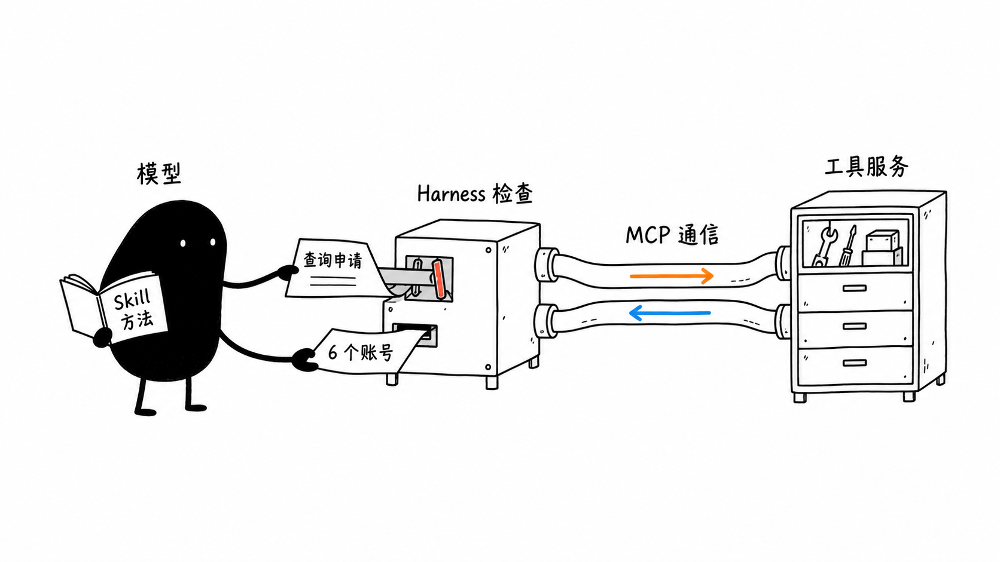

# 第 13 课：MCP 与 Skills——工具接入、任务方法与权限边界

“家庭套餐最多能用几个账号？”

上一课的客服助手会找资料，再根据原文回答。现在假设产品团队已经提供了查询函数：传入 family，就能取得账号上限 6。客服助手、运营助手都想使用它，我们不想让每个应用各抄一份规则。

把查询放到一个独立服务里，可以让大家查同一份数据。应用怎样知道它有哪些工具，参数怎么填，结果又怎样交给模型？本课沿着这一次查询，把接入过程走完。套餐数据是教学示例，不代表真实产品政策。

## 1. MCP：同一个查询，两种接法

先看最终要取得的内容：

```json
{"max_accounts": 6}
```

如果函数就在自己的项目里，原来的路径已经够用：

```text
模型提出查询 -> Harness 检查 -> 调用 get_plan -> 结果交回模型
```

查询工具由独立程序提供后，可以改成：

```text
模型提出查询 -> Harness 检查
-> 通过 MCP 请求工具服务 -> 执行 get_plan
-> 返回结果 -> Harness 把结果交回模型
```

这里换的是接法。**Model Context Protocol（MCP，模型上下文协议）**约定怎样交换工具说明、调用请求与结果，让支持它的应用按共同规则连接工具服务。查询函数仍然负责查数据。[1]

我会保留已经够用的直接调用；确实需要共享工具服务时，再考虑 MCP。普通 HTTP API、CLI 也能连接外部能力，MCP 不等于远程调用本身。

回到本例，整套客服助手叫 **Host（MCP 宿主应用）**，其中负责运行控制的部分是 Harness。Host 内负责与工具服务通信的组件叫 **MCP Client**，提供查询能力的程序叫 **MCP Server**。它们可以运行在同一台电脑上；Client 通常是 Host 的一部分，不是又一台需要部署的机器。[1]

## 2. Tool Discovery：工具说明由谁交给模型

服务端先登记：“我提供 get_plan，接收套餐名称。”下面是使用 MCP Python SDK 1.26.0 的缩小示例：[2]

```python
from mcp.server.fastmcp import FastMCP

server = FastMCP("套餐查询服务")


@server.tool()
def get_plan(plan: str) -> dict[str, int]:
    """查询套餐最多支持几个账号。"""
    limits = {"family": 6, "personal": 3}
    if not isinstance(plan, str) or plan not in limits:
        raise ValueError("只支持 family 或 personal")
    return {"max_accounts": limits[plan]}


if __name__ == "__main__":
    server.run(transport="stdio")
```

`get_plan` 是实际查询函数。`@server.tool()` 把它登记到 server，SDK 从函数名称、说明和类型标注生成工具描述。登记时不会查询套餐。

如果装饰器不直观，可以去掉它，在函数定义后写 `server.add_tool(get_plan)`，作用同样是登记。这里传递的是函数本身；`get_plan("family")` 才是立即执行。两种登记方式选一种即可。

最后的 `server.run(transport="stdio")` 开始接收请求。stdio 表示用标准输入接收客户端消息，用标准输出发送结果，不需要开放网络端口。请求指定 get_plan 时，Server 按登记表找到这个函数；run 不会自己扫描所有函数，更不会把它们挨个执行。调试信息应写到标准错误，别挤进协议消息的通道。

连接建立后，客户端先问工具清单：

```python
tools = await session.list_tools()
```

这是一段连接建立后的代码，不是独立脚本。`session` 是 MCP 连接对象，`await` 表示等待结果。对应的 `tools/list` 只问“有哪些工具”，还没有执行 get_plan。[3]

清单回到 Host，模型仍然看不到。**Host 要把选中的工具说明放进模型请求的 tools 字段。** 以前 tools 由开发者直接写好；现在也可以从 MCP Server 取得，再适配成模型接口要求的格式。

以本书使用的 Chat Completions 格式为例：

| 信息 | MCP 工具定义 | 模型接口中的 Function Tool |
| --- | --- | --- |
| 名称 | `name` | `function.name` |
| 用途 | `description` | `function.description` |
| 参数规则 | `inputSchema` | `function.parameters` |

两边都可以用 JSON Schema 描述参数，所以长得很像。模型接口并不完全统一，不能把这里的包装层照搬到所有接口。两份定义都不包含函数体，也不表示函数已经执行。[3][4]

## 3. Tool Calling：申请、执行与结果回传

用户问“家庭套餐支持几个账号”。模型读到工具说明后，可能提出如下申请。这里只展示名称和已解析的参数，不是完整协议报文：

```text
工具：get_plan
参数：{"plan": "family"}
```

到这里，模型还没查到 6。Harness 接过申请，检查工具名、参数和访问范围，通过后让 MCP Client 发送调用：

```python
result = await session.call_tool(
    "get_plan",
    arguments={"plan": "family"},
)
```

这里的参数是给定示例；接模型时，它们来自经过检查的调用申请。Server 收到对应的 `tools/call`，才按名称找到 `get_plan` 并执行，返回账号上限 6。[3]

结果回到了 Host，还没有回到模型。Harness 必须保留模型的调用消息，再追加对应的工具结果；本书用 `tool_call_id` 把申请与回执配对。随后再次请求模型，模型才有依据回答“家庭套餐最多支持 6 个账号”。打印结果、写入日志都不能代替这一步。

```text
用户提问 -> Host 把问题和工具说明交给模型
-> 模型提出调用 -> Harness 检查
-> MCP Client 发请求 -> Server 执行函数
-> Host 收到结果 -> Harness 把结果交回模型 -> 模型回答
```

代码中因此有两条连接：模型 Client 负责与模型交谈，MCP Client 负责与工具服务交谈。Harness 把两端接起来。Function Calling 与 MCP 可以出现在同一条链路里，并不互相排斥。

读取结果时，还要分清内容放在哪里。MCP 支持文本和结构化内容；返回的文本里装着 JSON，不代表结果对象一定有 `structuredContent`。先确认是否报错，再按实际返回格式取内容，别因为找错字段，把已经返回的 6 丢在半路。[3]

## 4. Skills：工具接好了，处理方法放在哪里

查询已经能往返，但客服每次还要记住同一套要求：先查规则、区分套餐、证据不足时询问。可以把这些方法收成一个 Agent Skill，让宿主在任务需要时加载：[5]

```text
回答套餐问题前先查询适用规则。
说明账号上限时区分家庭套餐与个人套餐。
资料不足就询问，不把搜索不到当成政策不存在。
```

**Agent Skill** 通常以 SKILL.md 为入口，还可以附带脚本、模板和参考资料。宿主先了解名称与用途，需要时再加载内容。Skill 提供方法；模型结合问题和已有结果提出下一步，Harness 控制实际执行。[5]



图中，小黑翻手册、递申请、接回执；手册没有连接检查机构的权限开关。橙色箭头表示请求，蓝色箭头表示结果。MCP 画成管道，是消息往返的比喻，不表示服务必须在远端。

Skill 可以指导模型使用 MCP 工具，也可以使用已有本地函数、CLI 或 API。两者解决的问题不同：Skill 保存任务方法，MCP 统一工具接入。已有好用的命令行工具时，“Skill + CLI”可能足够，不必再为同一动作搭一个 Server。

Skill 的说明可能遗漏步骤，模型也可能没有照做。必须执行的检查仍要由程序保证，不能只靠手册上的一句“请务必”。

## 5. 多层权限检查：手册不能替用户批准

假设以后增加退款工具。Skill 写着“符合条件就直接退款”，应用却要求退款前取得用户确认。模型读完 Skill，可能提交申请，甚至自己填上 `approved: true`。这句话不能成为批准记录，签名不能由申请人代写。

Harness 应先暂停退款，通过可信的用户交互取得确认，再核对订单、金额和操作是否与批准一致。用户只批准了查询，不能拿来退款；金额变了，也不能继续套用原来的批准。

这与前面几课的权限边界相同：

| 检查 | 负责的问题 |
| --- | --- |
| Harness 的工具与参数规则 | 本次允许提出、执行哪些调用？ |
| 工具服务的身份与资源检查 | 当前调用者有权查询这份订单或执行这项操作吗？ |
| 沙盒和执行环境 | 进程实际上能访问哪些文件、网络和系统资源？ |

`if tool_name != "get_plan"` 只是应用侧的工具允许名单；Server 只注册 get_plan，也只是限制提供的入口。两者都不能代替完整用户授权或操作系统隔离。通过 MCP 格式校验，更不等于业务操作已获准。

到这里，再看开头的查询：MCP 让助手接到工具服务，Skill 帮它沿着方法工作；哪个动作能执行、结果是否回到模型，仍由运行程序守住。把查询接通，不需要同时开放修改套餐或退款的能力。

## 配套实践

沿主图复述一次查询即可，不要求手写连接代码：工具说明由谁提供，模型的申请交给谁，函数在哪里执行，返回的 6 怎样进入下一次模型请求。再解释为什么模型自填 `approved: true` 不能代替用户确认。

想看真实代码，可以运行[本地 MCP 对照实验](../practice/optional/mcp/README.md)，它保留了直接调用与跨进程调用两种接法。之后可以继续到[第 14 课的运行控制](14-Agent运行控制.md)：MCP 不会自动提供共享并发、任务预算或资源回收策略。

## 资料

本地 MCP 实验于 2026-09-16 修复并复核结构化输出约定：family、personal 分别返回账号上限 6、3，无效套餐和不存在的写工具均返回错误。它验证了本地工具发现、跨进程调用与错误处理，尚未接入真实模型；正文的缩小示例与完整对照脚本尺度不同，实际实验以实践说明为准。

本课函数示例按 **MCP Python SDK 1.26.0** 核对。该版本使用 **2025-11-25** 协议；其客户端初始化握手不同于 **2026-07-28** 的新版发现流程，不要混用版本示例。协议的新旧变化不影响本课对应用、工具服务和执行权限的基本分工。[1][2]

1. [MCP 2026-07-28：Host、Client、Server 与协议范围](https://modelcontextprotocol.io/docs/2026-07-28/learn/architecture)
2. [MCP Python SDK v1.26.0：服务端与客户端示例](https://github.com/modelcontextprotocol/python-sdk/tree/v1.26.0)
3. [MCP 2025-11-25：工具定义、发现、调用与结果](https://modelcontextprotocol.io/specification/2025-11-25/server/tools)
4. [OpenAI：Function Calling 的工具说明与结果回传](https://developers.openai.com/api/docs/guides/function-calling)
5. [Agent Skills：格式与按需加载](https://agentskills.io/home)
