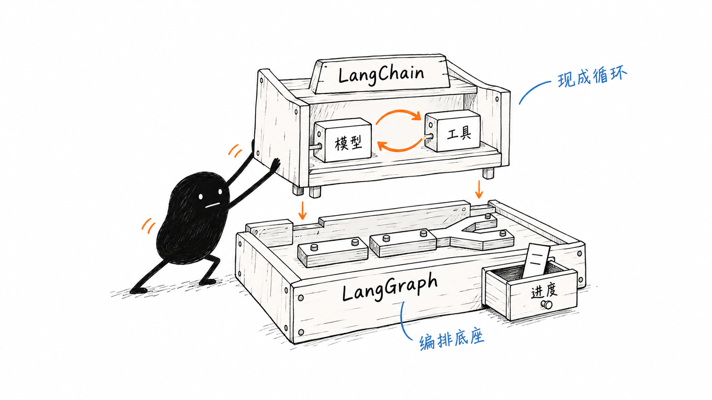

# 第 2 课：Agent Runtime——Model、Harness、Tool 与 Environment

上一课确定了只读排查助手的范围。现在它申请读取 `server.log`，界面却一直停在“正在读取”。订单服务为什么报 500 还没查清，排查助手自己先卡住了。

该换模型，还是检查文件？本课用这个假设情境拆开运行过程。下面的状态记录用于教学，不是配套程序已经复现的阻塞故障。

## 1. Runtime 组成：四种职责与具体对象

模型提出的读取申请，可以先用下面的简化形式表示；这里只展示工具名和参数，不代表某个模型 API 的完整响应：

```json
{"name":"read_file","arguments":{"path":"server.log"}}
```

申请交出以后，宿主程序要检查它、找到对应的工具函数，再把执行结果交回模型。这套组织和控制运行的代码通常叫 **Harness**。它可以由多个函数、模块或框架共同承担，不必是一个名为 Harness 的大类。

读取函数还要向文件系统索取数据。文件放在哪里、进程能否访问、底层存储是否响应，这些运行条件属于 **Environment（环境）**。

| 部分 | 在本例中对应什么 | 主要职责 |
| --- | --- | --- |
| Model | 收到排查目标和材料的语言模型 | 判断接下来需要什么信息，生成调用申请或回答 |
| Harness | 组织请求、检查调用、处理结果的宿主代码 | 推动运行，落实执行规则，决定继续或停止 |
| Tool | `read_file` 的实现函数 | 按约定读取内容，返回结果或错误 |
| Environment | 文件系统、进程身份、挂载与访问权限 | 提供工具实际接触的数据和运行条件 |

本书把这些部分协同工作的可运行整体称为 **Agent Runtime（Agent 运行时）**。这是一种职责划分，不要求拆成四个独立服务。本地 Python 程序里可以同时包含 Harness 和 Tool，模型则通过 API 调用。

## 2. Harness：输入组织、执行控制与结果回传

Harness 需要在具体位置作决定。沿这次日志读取看：

| 时刻 | 宿主程序的工作 | 本例需要核对什么 |
| --- | --- | --- |
| 请求模型前 | 选择输入和工具说明 | 是否提供了正确的日志位置与读取能力 |
| 收到申请后 | 校验工具名、参数与执行规则 | 是否只申请了允许的 `read_file` 和路径 |
| 调用工具时 | 找到实现，在选定环境执行 | 是否进入了正确的读取函数 |
| 工具返回后 | 保存并回传实际结果 | 内容或错误是否进入下一次模型请求 |
| 需要继续时 | 检查预算与停止条件 | 是否还能请求模型，是否应当停止或交给人 |

例如，申请读取 `server.log` 可以进入检查；申请读取 `../../secret.txt` 则要按路径规则判断，不能因为是模型生成的就放行。若应用要求审批，还须核对可信的批准记录。模型自己补一句“用户已同意”，不算批准。

结果回传同样会出错：文件已经读完，但程序没有把内容加入后续请求，模型仍然看不到日志。此时继续催它“认真分析”，相当于催一个没收到附件的人写结论。

Harness 可以处理失败，但处理方式要看证据和动作性质。返回错误、等待人工处理、停止运行都是可能的选择；不能把任何异常都当成可以重试，也不能把任何停止都当成任务完成。

## 3. Tool 与 Environment：实现逻辑和运行条件

`read_file` 规定怎样接收路径、读取字节、解码并返回内容；文件系统决定该路径上实际有什么，以及当前进程是否能访问。两者配合才能完成读取。

设想同一段工具代码运行在三个位置：

```text
开发机：server.log 存在，进程可以读取
容器中：日志目录没有挂载，目标路径找不到文件
沙盒中：文件存在，但访问被系统策略拒绝
```

工具把路径拼错了，要检查输入与路径处理逻辑；路径正确却无法访问，再核对部署环境和进程权限。换一个模型，并不会替容器挂上日志目录。

应用自己的路径检查也可能先于文件系统拒绝请求。因此，看到“无权限”时，要继续问拒绝来自哪里：Harness 的规则，还是工具调用系统时收到的错误？这决定了下一步应该检查哪处配置或代码。

这个区分帮助确定排查位置，不保证一个故障只涉及一层。例如模型给错了路径，可能同时暴露出工具说明含糊和校验不足；还要沿输入与返回结果继续核对。

## 4. 故障定位：沿执行证据缩小范围

回到开头，先确认下面的记录属于同一次日志读取。假设检查后拿到了这些状态：

```text
模型请求：已返回 read_file("server.log") 申请
工具查找：找到了 read_file 实现
参数与执行规则检查：通过
读取函数：已经进入
读取结果：尚未看到返回记录
```

前四行把排查重点移到了读取函数及其后续处理。这次模型请求已经返回，不能继续把等待都算在“模型还在思考”上。

但最后一行还不是根因。函数可能仍在等待，进程也可能已经退出，或者返回记录没有保存。**缺少一条记录，不等于已经证明那一步没有发生。** 先查进程是否存活、读取调用是否仍在等待、记录是否完整，再决定怎样处理。

如果随后确认读取调用确实在等网络文件系统返回，才进一步检查挂载、网络和存储响应。如果已有读取结果，就继续向后查回传环节。

| 已确认的现象 | 下一步优先核对 |
| --- | --- |
| 申请返回了，但找不到同名工具 | 工具注册、名称和路由 |
| 尚未进入读取函数，就被拒绝 | 参数、允许路径和审批规则 |
| 读取内容无法解码 | 实际文件编码与工具的解码方式 |
| 工具读完了，模型请求里没有内容 | Harness 的结果回传与输入组装 |
| 结果已回传，却持续重复同一动作 | 输入是否充分、模型选择以及循环预算和停止条件 |

我会先找出哪一步的输入或结果不符合预期，再决定改提示词、工具代码还是运行配置。

## 5. 框架定位：LangChain 与 LangGraph

LangChain 与 LangGraph 都是可以在 Python 程序中安装、调用的代码库。它们提供模型之外的程序部件，帮助开发者少写重复的运行代码。



图把软件关系画成了装配动作：上层是现成的模型与工具循环，下层提供编排和状态管理能力。它不表示两台独立设备。

### 5.1 LangChain：Agent Loop 的现成实现

做排查助手时，你提供一个模型、自己实现的 `read_file` 工具，以及“查清接口为什么报错”的任务。LangChain 的 Agent 可以组织这样的往返过程：

```text
模型申请读日志 -> 程序调用 read_file -> 日志交回模型
模型申请读源码 -> 程序调用 read_file -> 源码交回模型
模型给出诊断
```

这些请求模型、执行工具、回传结果的循环代码，本来需要自己写；LangChain 提供了现成入口。**它省掉的是组织循环的工作。** 模型选择什么材料，仍由模型判断；文件具体怎样读取，仍由你提供的工具完成。[6] 上面是流程示意，不是一次真实模型运行记录。

### 5.2 LangGraph：任务编排与状态管理

以后把助手扩展成“可以修复代码”，可能需要这样的验收分支：

```text
诊断 -> 修改 -> 运行测试
                 |
                 +-- 通过：交付
                 +-- 未通过且次数未达上限：回到修改
                 +-- 未通过且次数已达上限：停止
```

LangGraph 帮你执行这些相互连接的步骤。每个步骤对应一个**节点（Node）**，步骤间的连接决定接下来去哪。节点可以调用 LangChain Agent，也可以只是普通 Python 函数，例如运行测试。

需要暂停或重启后继续时，还可以配置状态保存与恢复。图中的“进度”抽屉表示这项能力；它不会自动替你设计全部恢复规则。修改次数上限、异常处理和访问权限仍要由应用明确设置。[7]

**LangChain 的 Agent 建立在 LangGraph 之上**，所以图里是上下两层。使用 LangChain 不要求先手写 LangGraph 流程；直接使用 LangGraph，也不必依赖 LangChain。LangChain 同样支持定制和持久化，“现成”不等于“不能改”。[6][7]

开源 Agent 不一定使用这些框架，模块名称也未必叫 Harness。本书核验的 OpenCode 版本把会话处理、工具查找和权限判断放在不同模块中，合起来承担运行控制的职责。[1][2][3] 阅读源码时，应追踪谁接住请求、谁执行动作、谁处理结果，而不是只找一个同名文件。

下一课把这些职责接成一个最小 **Tool Calling Loop**：保存调用申请，执行工具，带着对应编号回传结果，再决定继续或结束。第 10 课再对照框架怎样组织更长的任务。

## 资料与配套材料

1. [OpenCode：会话处理](https://github.com/anomalyco/opencode/blob/50efc055de282e0e54a87ccebb8e2054cc45efd2/packages/opencode/src/session/processor.ts)
2. [OpenCode：工具注册](https://github.com/anomalyco/opencode/blob/50efc055de282e0e54a87ccebb8e2054cc45efd2/packages/opencode/src/tool/registry.ts)
3. [OpenCode：权限判断](https://github.com/anomalyco/opencode/blob/50efc055de282e0e54a87ccebb8e2054cc45efd2/packages/opencode/src/permission/evaluate.ts)
4. [固定源码与核验记录](../../research/01-05-chapter-promotion-sources.md)
5. [配套综合实践](../../exercises/phase-1-capstone/README.md)
6. [LangChain：Agent 框架与模型接口](https://docs.langchain.com/oss/python/langchain/overview)
7. [LangGraph：编排运行时与 LangChain 的关系](https://docs.langchain.com/oss/python/langgraph/overview)
